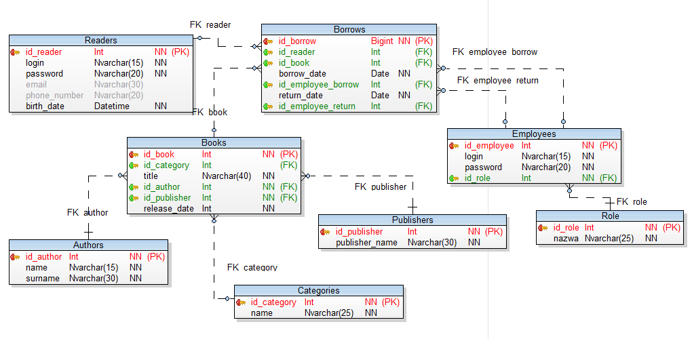
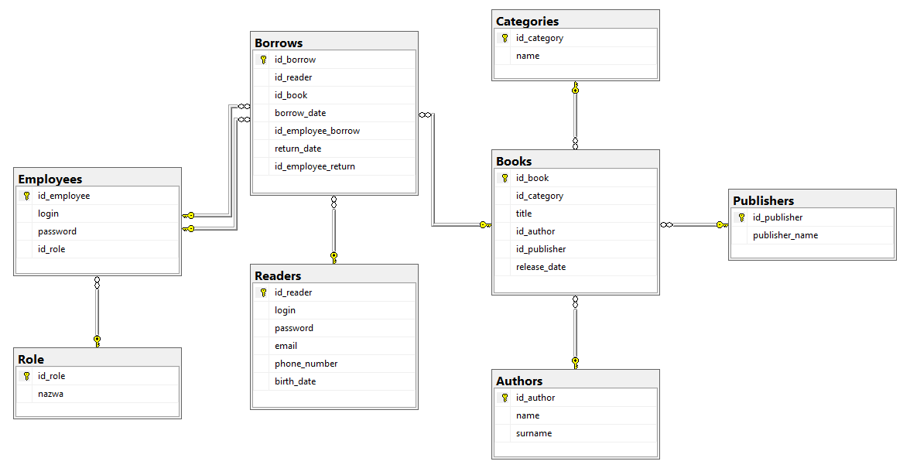

# Prosta baza danych SQL dla biblioteki - LibraryDB
> Projekt semestralny z przedmiotu wprowadzenie do baz danych 2018/19 – _LibraryDB (biblioteka)_
> Wersja: _2019-01-27_
Dokumentacja projektowa (LibraryDB - biblioteka)

## 1.	Założenia projektowe
### 1.1.	Cel biznesowy

Celem aplikacji jest dostarczenie informacji o przepływie (wypożyczeniach i zwrotach) książek, wykaz czytelników oraz pracowników biblioteki (wraz z danymi dostępowymi do platformy bibliotecznej oraz adresowymi), klasyfikacja zalistowanych książek po ich gatunkach oraz wydawnictwie. Identyfikatory (nazwy zmiennych, funkcji) są w języku angielskim.

### 1.2.	Wymagania funkcjonalne (główne realizowane funkcje)

*	pracownik biblioteki może wydać/przyjąć książkę
*	czytelnik może wypożyczyć książkę
*	czytelnik może prolongować książkę
*	pracownik może dodać nową książkę do zbioru bibliotecznego

### 1.3.	Wymagania niefunkcjonalne (np. potencjalne założenia co do ilości danych, wydajności, dostępności)

* baza biblioteki nie ma limitu zalistowanych książek
* pracownicy bibiloteki mają wgląd jedynie do wymaganych danych (RODO)
* przed zabookowaniem danej książki powinna zostać sprawdzona jej dostępność

### 1.4.	zdefiniowanie użytkowników
*	rola 1 – kierownik biblioteki
*	rola 2 – dział obsługi klienta
*	rola 3 – czytelnik

### 1.5.	opis przykładowych scenariusza użycia (dla zdefiniowanych użytkowników)
*	kierownik ma uprawnienia administratora bazy
*	różni pracownicy mogą wydać oraz przyjąć książkę
*	czytelnik może wypożyczyć każdą dostępną książkę

##2.	Opis modelu danych
### 2.1.	Diagram ERD

### 2.2.	Lista tabel wraz z dokładnym opisem typów i znaczenia danych; opis tabeli w formacie: nazwa kolumny, typ danych, opis (znaczenie na poziomie biznesowym i technicznym, np. znaczenie skrótów)

__*Categories*__ (zawiera gatunki książek)
* Id_category – obowiązkowe, klucz główny, liczba całkowita
* Name – obowiązkowe, napis nie więcej niż 25 znaków

__*Authors*__ (zawiera autorów książek)
* Id_author – obowiązkowe, klucz główny, liczba całkowita
* Name – obowiązkowe, napis nie więcej niż 15 znaków
* Surname- obowiązkowe, napis nie więcej niż 30 znaków

__*Publishers*__ (zawiera wydawców książek)
* Id_publisher – obowiązkowe, klucz główny, liczba całkowita
* Publisher_name – obowiązkowe, napis nie więcej niż 30 znaków

__*Books*__ (zawiera tytuł oraz datę wydania książki)
* Id_book – obowiązkowe, klucz główny, liczba całkowita
* Id_category – klucz obcy, liczba całkowita
* Title – obowiązkowe, napis nie więcej niż 40 znaków
* Id_author – klucz obcy, liczba całkowita
* Id_publisher – klucz obcy, liczba całkowita
* Release_date – obowiązkowe, liczba całkowita

__*Readers*__ (zawiera informacje dotyczące czytelników biblioteki)
* Id_reader – obowiązkowe, klucz główny, liczba całkowita
* Login – obowiązkowe, napis nie więcej niż 15 znaków
* Password – obowiązkowe, napis nie więcej niż 20 znaków
* Email – napis nie więcej niż 30 znaków
* Phone_number – napis nie więcej niż 20 znaków
* Birth_Date – obowiązkowe, data

__*Borrows*__ (zawiera informacje dotyczące wypożyczeń książek przez czytelników bądź pracowników)
* Id_borrow – obowiązkowe, klucz główny, liczba całkowita (bigint)
* Id_reader – klucz obcy, liczba całkowita
* Id_book – klucz obcy, liczba całkowita
* Borrow_Date – obowiązkowe, data
* Return_date – obowiązkowe, data
* Id_employee_borrow – klucz obcy, liczba całkowita
* Id_employee_return – klucz obcy, liczba całkowita

__*Employees*__ (zawiera informacje dotyczące pracowników)
* Id_employee – obowiązkowe, klucz główny, liczba całkowita
* Login – obowiązkowe, napis nie więcej niż 15 znaków
* Password – obowiązkowe, napis nie więcej niż 20 znaków
* Id_role – klucz obcy, liczba całkowita

__*Role*__ (zawiera role pracowników biblioteki)
* Id_role – obowiązkowe, klucz główny, liczba całkowita
* Nazwa – obowiązkowe, napis nie więcej niż 25 znaków
